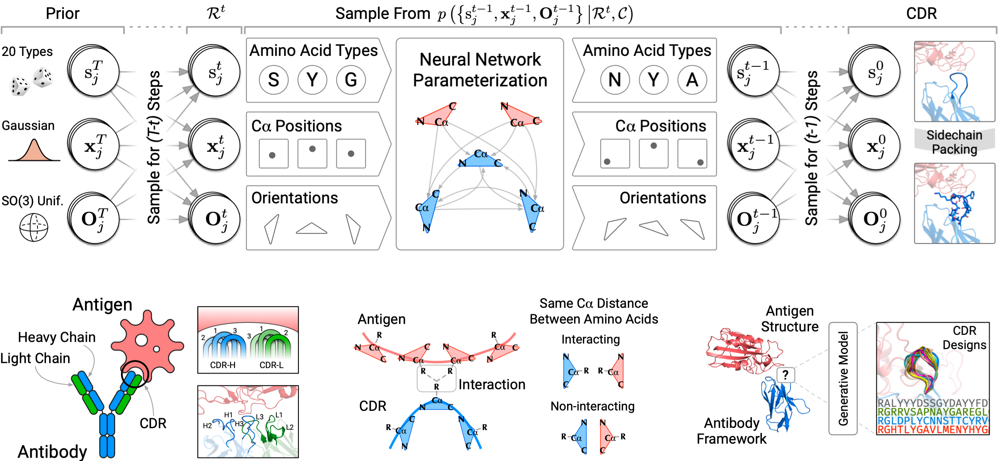

# DiffAb



Antigen-Specific Antibody Design and Optimization with Diffusion-Based Generative Models for Protein Structures (NeurIPS 2022) 

[[Paper]](https://www.biorxiv.org/content/10.1101/2022.07.10.499510.abstract)[[Demo]](https://huggingface.co/spaces/luost26/DiffAb)

## Install

### Environment

```bash
conda env create -f env.yaml -n diffab
conda activate diffab
```

The default `cudatoolkit` version is 11.3. You may change it in [`env.yaml`](./env.yaml).

### Datasets and Trained Weights

Protein structures in the `SAbDab` dataset can be downloaded [**here**](https://opig.stats.ox.ac.uk/webapps/newsabdab/sabdab/archive/all/). Extract `all_structures.zip` into the `data` folder. 

The `data` folder contains a snapshot of the dataset index (`sabdab_summary_all.tsv`). You may replace the index with the latest version [**here**](https://opig.stats.ox.ac.uk/webapps/newsabdab/sabdab/summary/all/).

Trained model weights are available [**here** (Hugging Face)](https://huggingface.co/luost26/DiffAb/tree/main) or [**here** (Google Drive)](https://drive.google.com/drive/folders/15ANqouWRTG2UmQS_p0ErSsrKsU4HmNQc?usp=sharing).

### [Optional] HDOCK

HDOCK is required to design CDRs for antigens without bound antibody frameworks. Please download HDOCK [**here**](http://huanglab.phys.hust.edu.cn/software/hdocklite/) and put the `hdock` and `createpl` programs into the [`bin`](./bin) folder.

### [Optional] PyRosetta

PyRosetta is required to relax the generated structures and compute binding energy. Please follow the instruction [**here**](https://www.pyrosetta.org/downloads) to install.

### [Optional] Ray

Ray is required to relax and evaluate the generated antibodies. Please install Ray using the following command:

```bash
pip install -U ray
```

## Design Antibodies

5 design modes are available. Each mode corresponds to a config file in the `configs/test` folder:

| Config File              | Description                                                  |
| ------------------------ | ------------------------------------------------------------ |
| `codesign_single.yml`    | Sample both the **sequence** and **structure** of **one** CDR. |
| `codesign_multicdrs.yml` | Sample both the **sequence** and **structure** of **all** the CDRs simultaneously. |
| `abopt_singlecdr.yml`    | Optimize the **sequence** and **structure** of **one** CDR.  |
| `fixbb.yml`              | Sample only the **sequence** of **one** CDR (fix-backbone sequence design). |
| `strpred.yml`            | Sample only the **structure** of **one** CDR (structure prediction). |

### Antibody-Antigen Complex

Below is the usage of `design_pdb.py`. It samples CDRs for antibody-antigen complexes. The full list of options can be found in [`diffab/tools/runner/design_for_pdb.py`](diffab/tools/runner/design_for_pdb.py).

```bash
python design_pdb.py \
	<path-to-pdb> \
	--heavy <heavy-chain-id> \
	--light <light-chain-id> \
	--config <path-to-config-file>
```

The `--heavy` and  `--light` options can be omitted as the script can automatically identify them with AbNumber and ANARCI.

The below example designs the six CDRs separately for the `7DK2_AB_C` antibody-antigen complex.

```bash
python design_pdb.py ./data/examples/7DK2_AB_C.pdb \
	--config ./config/test/codesign_single.yml
```

### Antigen Only

HDOCK is required to design antibodies for antigens without bound antibody structures (see above for instructions on installing HDOCK). Below is the usage of `design_dock.py`. 

```bash
python design_dock.py \
	--antigen <path-to-antigen-pdb> \
	--antibody <path-to-antibody-template-pdb> \
	--config <path-to-config-file>
```

The `--antibody` option is optional and the default antibody template is [`3QHF_Fv.pdb`](data/examples/3QHF_Fv.pdb). The full list of options can be found in the script.

Below is an example that designs antibodies for SARS-CoV-2 Omicron RBD.

```python
python design_dock.py \
	--antigen ./data/examples/Omicron_RBD.pdb \
	--config ./config/test/codesign_multicdrs.yml
```

## Train

```bash
python train.py ./configs/train/<config-file-name>
```

## Reference

```bibtex
@inproceedings{luo2022antigenspecific,
  title={Antigen-Specific Antibody Design and Optimization with Diffusion-Based Generative Models for Protein Structures},
  author={Shitong Luo and Yufeng Su and Xingang Peng and Sheng Wang and Jian Peng and Jianzhu Ma},
  booktitle={Advances in Neural Information Processing Systems},
  editor={Alice H. Oh and Alekh Agarwal and Danielle Belgrave and Kyunghyun Cho},
  year={2022},
  url={https://openreview.net/forum?id=jSorGn2Tjg}
}
```
